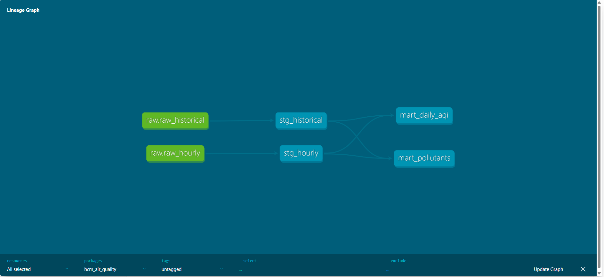
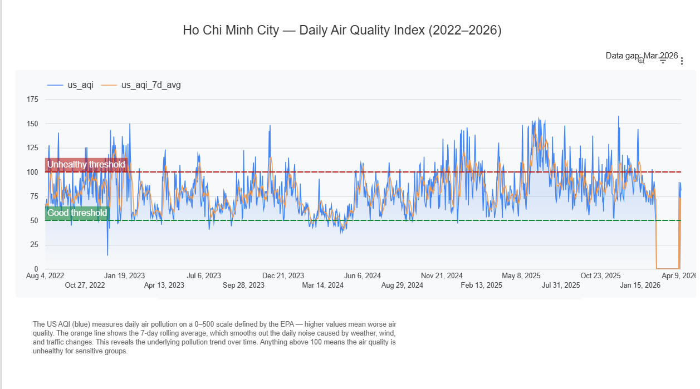
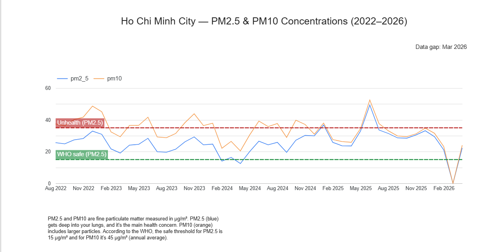

# HCM Air Quality Analytics Pipeline

> An end-to-end batch data pipeline that ingests four years of air quality data
> for Ho Chi Minh City, transforms it through a medallion architecture on GCS and
> BigQuery, and surfaces pollution trends via a Looker Studio dashboard.


---

## Problem Statement

Ho Chi Minh City consistently ranks among Southeast Asia's most polluted cities,
with AQI levels frequently exceeding WHO safe thresholds due to dense traffic,
industrial activity, and seasonal weather patterns. Despite the availability of
historical air quality data, there is no accessible tool that surfaces multi-year
pollution trends and category distributions for public awareness.

This pipeline processes daily historical measurements (2022–2026) combined with
live hourly API data, enabling data-driven answers to questions like: _When does
air quality deteriorate most? Which pollutants dominate? Are conditions improving
year over year?_

---

## Architecture

```
Open-Meteo API  ──► Kestra ──► GCS bronze/hourly/YYYY-MM-DD/HH/
Zenodo CSV      ──► Kestra ──► GCS bronze/historical/
                                        │
                                     PySpark
                                        │
                         GCS silver/hourly/  +  silver/historical/
                                        │
                                    BigQuery
                                        │
                   dbt (stg_hourly + stg_historical → mart_daily_aqi + mart_pollutants)
                                        │
                               Looker Studio dashboard
```



> Infrastructure (GCS bucket + BigQuery dataset) is provisioned by Terraform.
> Kestra runs locally via Docker Compose.
> PySpark runs locally; development done in Jupyter notebooks under `notebooks/`.

---

## Tech Stack

| Layer          | Tool                                            |
| -------------- | ----------------------------------------------- |
| Infrastructure | Terraform + GCP                                 |
| Orchestration  | Kestra (Docker Compose)                         |
| Processing     | PySpark                                         |
| Data Lake      | Google Cloud Storage (medallion: bronze/silver) |
| Data Warehouse | BigQuery (partitioned external tables)          |
| Transformation | dbt                                             |
| Dashboard      | Looker Studio                                   |

---

## Why this stack?

PySpark is used for the bronze→silver transformation to demonstrate batch
processing skills. For this data volume (≈1,300 rows historical + hourly
increments), BigQuery SQL alone would be sufficient in production. The stack
reflects DE Zoomcamp curriculum coverage and a realistic junior DE portfolio.

---

## Data Sources

### Historical (one-time backfill)

- **Source:** [Zenodo — Air Quality Dataset for Ho Chi Minh City](https://zenodo.org/records/18673714)
- **Author:** Nitiraj Kulkarni
- **Coverage:** 2022-08-01 to 2026-02-18, daily averages
- **Columns:** `date, pm10, pm2_5, carbon_monoxide, nitrogen_dioxide, sulphur_dioxide, ozone, aerosol_optical_depth, dust, uv_index, us_aqi, european_aqi`
- **Note:** Raw date format is `DD-MM-YY` — converted to `YYYY-MM-DD` in PySpark

### Live (hourly)

- **Source:** [Open-Meteo Air Quality API](https://open-meteo.com/en/docs/air-quality-api)
- **Coordinates:** 10.8231° N, 106.6297° E (Ho Chi Minh City)
- **Frequency:** Every hour via Kestra scheduler
- **Auth:** None required (free API)

---

## Repository Structure

```
hcm-air-quality-pipeline/
├── terraform/              # GCS + BigQuery provisioning
├── kestra/
│   ├── docker-compose.yml
│   ├── spark.Dockerfile
│   ├── transform_hourly.py
│   ├── setup_kv.sh
│   └── flows/
│       ├── hourly_air_quality_ingest.yml
│       └── historical_backfill.yml
├── notebooks/              # PySpark development (Jupyter)
│   ├── transform_historical.ipynb
│   └── transform_hourly.ipynb
├── dbt/                    # Transformation models
│   └── hcm_air_quality/
│       ├── models/
│       │   ├── staging/
│       │   └── marts/
│       └── tests/          # Custom data quality tests
├── data/                   # Local raw data (gitignored)
├── keys/                   # GCP service account key (gitignored)
└── README.md
```

---

## GCS Structure

```
hcm-air-quality-486008/
├── bronze/
│   ├── hourly/YYYY-MM-DD/HH/air_quality.json     ← raw API response (one per hour)
│   └── historical/air_quality_historical.csv     ← raw Zenodo CSV
└── silver/
    ├── hourly/date=YYYY-MM-DD/                   ← cleaned Parquet, partitioned by date
    └── historical/                               ← cleaned Parquet
```

---

## Warehouse Design

BigQuery external tables point directly at GCS silver Parquet files:

- **Partitioned by** `date` — eliminates full scans for date-range queries

dbt layers:

| Layer   | Model             | Description                                          |
| ------- | ----------------- | ---------------------------------------------------- |
| Staging | `stg_hourly`      | Timestamp parsing, type casting, column renaming     |
| Staging | `stg_historical`  | Date format fix (`DD-MM-YY` → `DATE`), type casting  |
| Mart    | `mart_daily_aqi`  | Daily AQI, 7-day rolling average, AQI category label |
| Mart    | `mart_pollutants` | Daily pollutant concentrations (PM2.5, PM10, etc.)   |

**dbt tests:** 10 tests total — `not_null`, `unique`, `accepted_values` on mart columns,
plus custom range checks (`assert_aqi_range`, `assert_pollutants_non_negative`).



---

## How to Reproduce

### Prerequisites

- GCP account with billing enabled
- Terraform ≥ 1.5 installed
- Docker + Docker Compose installed
- Python 3.11+ with `uv` or `pip`
- Java 17 (required for PySpark)

### Step 1 — Clone and configure

```bash
git clone https://github.com/luc-dt/hcm-air-quality-pipeline
cd hcm-air-quality-pipeline
```

Place your GCP service account key at `keys/hcm-pipeline-sa.json` (gitignored).

### Step 2 — Provision infrastructure

```bash
cd terraform
terraform init
terraform apply
```

Creates GCS bucket `hcm-air-quality-486008` and BigQuery dataset `hcm_air_quality`
in `asia-southeast1`.

### Step 3 — Download historical dataset

Download `air_quality_historical.csv` from
[Zenodo](https://zenodo.org/records/18673714) and place it at
`data/air_quality_historical.csv`.

### Step 4 — Start Kestra

```bash
cd kestra
docker compose up -d
# UI available at http://localhost:8080
# Default credentials are configured in kestra/docker-compose.yml
```

### Step 5 — Import flows and populate Kestra KV store

In the Kestra UI at http://localhost:8080, go to **Flows → Import** and upload
both YAML files from `kestra/flows/`.

Then run this once to load your GCP credentials:

```bash
bash kestra/setup_kv.sh
```

This reads `keys/hcm-pipeline-sa.json` and loads it into the Kestra KV store
as `GCP_CREDS`. You should see `HTTP: 200` and "KV store populated".

### Step 6 — Run Kestra flows

In the Kestra UI, execute:

1. `hcm_pipeline / historical_backfill` — uploads CSV to `bronze/historical/`
2. `hcm_pipeline / hourly_air_quality_ingest` — starts hourly data collection

### Step 7 — Run PySpark transforms

```bash
export GOOGLE_APPLICATION_CREDENTIALS=keys/hcm-pipeline-sa.json

# Historical (one-time)
jupyter notebook notebooks/transform_historical.ipynb

# Hourly (run for a specific date/hour you have in bronze)
jupyter notebook notebooks/transform_hourly.ipynb
```

### Step 8 — Create BigQuery external tables

In BigQuery Query Editor, create two external tables pointing at GCS silver layer:

```sql
-- Hourly external table (Hive-partitioned by date)
CREATE OR REPLACE EXTERNAL TABLE `de-zoomcamp-2026-486008.hcm_air_quality.raw_hourly`
WITH PARTITION COLUMNS (date DATE)
OPTIONS (
  format = 'PARQUET',
  uris = ['gs://hcm-air-quality-486008/silver/hourly/*'],
  hive_partition_uri_prefix = 'gs://hcm-air-quality-486008/silver/hourly/'
);

-- Historical external table
CREATE OR REPLACE EXTERNAL TABLE `de-zoomcamp-2026-486008.hcm_air_quality.raw_historical`
OPTIONS (
  format = 'PARQUET',
  uris = ['gs://hcm-air-quality-486008/silver/historical/*.parquet']
);
```

### Step 9 — Run dbt

Create `~/.dbt/profiles.yml` with the following content:

```yaml
hcm_air_quality:
  target: dev
  outputs:
    dev:
      type: bigquery
      method: service-account
      project: de-zoomcamp-2026-486008
      dataset: hcm_air_quality
      location: asia-southeast1
      keyfile: keys/hcm-pipeline-sa.json
      threads: 4
      timeout_seconds: 300
```

Then run:

```bash
cd dbt/hcm_air_quality
dbt debug        # verify connection before running models
dbt run
dbt test
```

### Step 10 — View dashboard

[View AQI Dashboard](https://lookerstudio.google.com/reporting/6439d918-7211-40b9-b49a-0bc56a0fd8e6)



_7-day rolling AQI average shows consistent Moderate–Unhealthy levels across 2022–2026, with seasonal spikes in dry season months._

[View PM2.5 Dashboard](https://lookerstudio.google.com/reporting/4a9bf4b6-6383-4f5a-ac60-a8e2be89521e)



_PM2.5 and PM10 concentrations consistently exceed WHO annual safe thresholds (15 µg/m³ and 45 µg/m³ respectively)._

> **Note:** Data gap exists for March 2026 — the historical dataset ends Feb 18, 2026
> and live hourly collection began April 8, 2026. The pipeline is operational;
> the gap reflects the project start date, not a pipeline failure.

---
