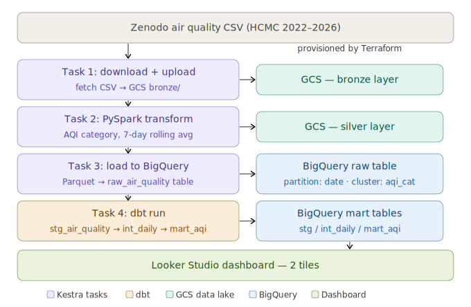

# HCM Air Quality Analytics Pipeline

> An end-to-end batch data pipeline that ingests four years of hourly
> air quality data for Ho Chi Minh City, processes it through a
> cost-optimized BigQuery warehouse, and surfaces pollution trends
> via a Looker Studio dashboard.

---

## Problem Statement

Ho Chi Minh City consistently ranks among Southeast Asia's most
polluted cities, with AQI levels frequently exceeding WHO safe
thresholds due to dense traffic, industrial activity, and seasonal
weather patterns. Despite the availability of historical air quality
data, there is no accessible tool that surfaces multi-year pollution
trends and category distributions for public awareness.

This pipeline processes hourly AQI and pollutant measurements
(PM2.5, PM10, CO, NO₂, SO₂, O₃) from 2022 to 2026, enabling
data-driven answers to questions like: _When does air quality
deteriorate most? Which pollutant categories dominate? Are conditions
improving year over year?_

---

## Architecture

```
Zenodo CSV → GCS (bronze) → PySpark → GCS (silver)
→ BigQuery (raw) → dbt (stg → int → mart) → Looker Studio
```



---

## Tech Stack

| Layer          | Tool                               |
| -------------- | ---------------------------------- |
| Infrastructure | Terraform + GCP                    |
| Orchestration  | Kestra                             |
| Processing     | PySpark (Docker)                   |
| Data Lake      | Google Cloud Storage               |
| Data Warehouse | BigQuery (partitioned + clustered) |
| Transformation | dbt                                |
| Dashboard      | Looker Studio                      |

---

## Dataset

- **Source:** [Zenodo — Air Quality Dataset for Ho Chi Minh City (2022–2026)](https://zenodo.org/records/18673714)
- **Author:** Nitiraj Kulkarni
- **Coverage:** 2022-08-01 to 2026-02-18, hourly resolution
- **Key fields:** `datetime`, `aqi`, `pm2_5`, `pm10`, `co`, `no2`, `so2`, `o3`

---

## Dashboard

_(add Looker Studio public link here)_

---

## How to Reproduce

### Prerequisites

- GCP account with billing enabled
- Terraform installed
- Docker + Docker Compose installed
- Python 3.11+

### Step 1 — Clone and configure

```bash
git clone https://github.com/yourname/hcm-air-quality-pipeline
cd hcm-air-quality-pipeline
cp .env.example .env
# fill in your GCP project ID and bucket name
```

### Step 2 — Provision infrastructure

```bash
cd terraform
terraform init
terraform apply
```

### Step 3 — Download dataset

Download `air_quality_historical.csv` from [Zenodo](https://zenodo.org/records/18673714)
and place it in `data/air_quality_historical.csv`.

### Step 4 — Start Kestra

```bash
cd kestra
docker compose up -d
# open http://localhost:8080
```

### Step 5 — Run the pipeline

Import `kestra/flows/hcm_pipeline.yaml` into Kestra UI and execute.

### Step 6 — Run dbt

```bash
cd dbt
dbt deps
dbt run
dbt test
```

### Step 7 — View dashboard

Open the Looker Studio link above.

---

## Warehouse Design

`raw_air_quality` in BigQuery is:

- **Partitioned by** `DATE(datetime)` — eliminates full scans
  for date-range queries
- **Clustered by** `aqi_category` — accelerates categorical
  filtering used by dashboard Tile 1

---

## License

MIT
